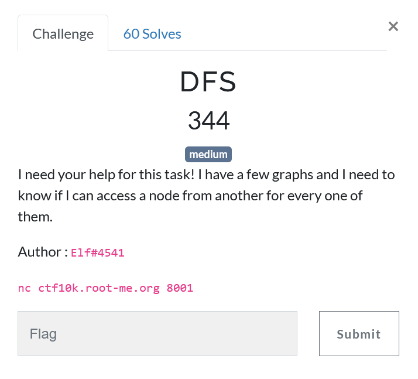

# DFS



## Goal

Let's see what the challenge consist of, to do that, were gonna use netcat


We can see that the server asks if we can reach one node from another in a oriented graph. It then gives all the relation between the nodes.

## Structure of the program

So what we need to do is :

1. Create the graph 

2. Retrieve the two nodes that we need to test

3. Test if there is a path between them

4. Send the answer

## Graph handling

To do the first and third step, I rembered of an old script that I did at school to learn python classes, so I just needed to do step 3 and 4.

The source code of this script is [here](./graphes_avec_class.py) (the program was written in french).

What we need to know about that program is that is has a class called `graphs`, out of all the functions and methods that it contains we will use

- `ajouterSommet(name:str)` : Add a node called name

- `ajouterArete(name1:str, name2:str)` : Add a path name1 -> name2

- `existeChemin(name1:str, name2:str) -> bool` : Returns True or False, depending if theres a path from name1 to name2

## Main program

Now, lets start creating the main program.

Firstly, let's start creating the connection with the socket library.

```python
from graphes_avec_class import graphs

import socket

host = "ctf10k.root-me.org"
port = 8001
s = socket.socket(socket.AF_INET, socket.SOCK_STREAM)
s.connect((host, port))


while True:
    eq = s.recv(2048).decode()
    print(eq)

```

Ok, so we have a connection, now let's focus on creating the graph.

```python
while True:
    eq = s.recv(2048).decode()
    print(eq)

    # replace what we don't need
    eq = eq.replace("Hello there! I need some help for my homework, pleeeease.\n", '').replace("\n>", '').replace("Okay, this seems correct!\n", '')

    # split into 2 parts, the question and the data
    question = str(eq.split('\n')[:1])
    graph_data = eq.split('\n')[1:]

    # create our graph instance
    myGraph = graphs()

    # create the list that will contain the relations between nodes
    # we will use it later because if we try to add a relation with nodes that don't exist, it will cause an error
    le_connections = []

    # creation of the nodes a filling the list above
    for node in graph_data:
        node = node.replace("Node ", '')
        # if the node dont have any relation
        if "no" in node:
            node = node.replace(" has no directed edge", '')
            # append the node to the graph
            myGraph.ajouterSommet(node.replace(" ", ''))
        else:
            # if the node has relations
            name, connections = tuple(node.split(" has a directed edge to : "))
            # append the node to our graph
            myGraph.ajouterSommet(name.replace(" ", ''))
            # store the relations in our list
            le_connections.append((name, connections.split(", ")))

    # time to create the relations
    for nom, connections in le_connections:
        for conn in connections:
            # append the relation to the graph
            myGraph.ajouterArete(nom.replace(' ', ''), conn.replace(" ", ''))

```

So, now that we have our graaph, let's figure out what path we have to test and send the answer.

```python
while True:
    eq = s.recv(2048).decode()
    print(eq)

    # .... the program that we created above


    question = question.split("Here's my graph's adjacency list, can you tell me if I can reach node ")[1]

    question = question.replace(" please? (yes / no)\"]", '')

    # figure out the target and the node that we depart from
    target, name = question.split(" from ")

    # use the function existeChemin and give the answer according to the result
    answer = "yes" if myGraph.existeChemin(name, target) != [] else "no"


    print("[+] Sending", answer, "for", name, "->", target)

    # send the answer (don't forget the \n to simulate ENTER)
    answer = answer + '\n'
    s.send(answer.encode())

```

Now, it only remains to execute the program

```
Hello there! I need some help for my homework, pleeeease.
[1/60] Here's my graph's adjacency list, can you tell me if I can reach node 5 from 14 please? (yes / no)
Node 0 has a directed edge to : 3
Node 1 has a directed edge to : 7
Node 2 has a directed edge to : 14
Node 3 has no directed edge
Node 4 has a directed edge to : 11, 14
Node 5 has no directed edge
Node 6 has a directed edge to : 1, 3, 11
Node 7 has a directed edge to : 9
Node 8 has a directed edge to : 15
Node 9 has a directed edge to : 3
Node 10 has no directed edge
Node 11 has a directed edge to : 4
Node 12 has a directed edge to : 3, 13
Node 13 has no directed edge
Node 14 has a directed edge to : 0, 3
Node 15 has a directed edge to : 12, 13
Node 16 has a directed edge to : 5
Node 17 has a directed edge to : 7
> 
[+] Sending no for 14 -> 5
Okay, this seems correct!
[2/60] Here's my graph's adjacency list, can you tell me if I can reach node 15 from 7 please? (yes / no)
Node 0 has a directed edge to : 4
Node 1 has a directed edge to : 3
Node 2 has no directed edge
Node 3 has a directed edge to : 5, 11, 15, 16, 18
Node 4 has a directed edge to : 0, 14
Node 5 has a directed edge to : 1, 9
Node 6 has a directed edge to : 7, 13, 18
Node 7 has a directed edge to : 2, 3, 5, 6, 11, 14, 15
Node 8 has a directed edge to : 1, 9
Node 9 has no directed edge
Node 10 has a directed edge to : 12
Node 11 has a directed edge to : 10
Node 12 has a directed edge to : 0, 1, 9
Node 13 has a directed edge to : 3, 7
Node 14 has no directed edge
Node 15 has a directed edge to : 7, 8, 10, 14
Node 16 has no directed edge
Node 17 has no directed edge
Node 18 has a directed edge to : 7
> 
[+] Sending yes for 7 -> 15
Okay, this seems correct!
[3/60] Here's my graph's adjacency list, can you tell me if I can reach node 20 from 7 please? (yes / no)
Node 0 has no directed edge
Node 1 has a directed edge to : 8, 20
Node 2 has a directed edge to : 0, 9
Node 3 has a directed edge to : 9
Node 4 has a directed edge to : 12
Node 5 has a directed edge to : 8, 10, 13
Node 6 has a directed edge to : 3
Node 7 has a directed edge to : 2, 8
Node 8 has a directed edge to : 4
Node 9 has a directed edge to : 5, 6, 12
Node 10 has a directed edge to : 7, 9, 17
Node 11 has a directed edge to : 0, 1, 8
Node 12 has no directed edge
Node 13 has a directed edge to : 6, 12, 18
Node 14 has a directed edge to : 16
Node 15 has no directed edge
Node 16 has a directed edge to : 0, 15, 20
Node 17 has a directed edge to : 14
Node 18 has no directed edge
Node 19 has a directed edge to : 0
Node 20 has a directed edge to : 2, 5, 13, 17
> 
[+] Sending yes for 7 -> 20
Okay, this seems correct!
[4/60] Here's my graph's adjacency list, can you tell me if I can reach node 2 from 13 please? (yes / no)
Node 0 has a directed edge to : 7
Node 1 has a directed edge to : 4, 5, 9, 13, 14
Node 2 has no directed edge
Node 3 has a directed edge to : 18
Node 4 has a directed edge to : 6, 12
Node 5 has a directed edge to : 11, 12
Node 6 has a directed edge to : 16
Node 7 has a directed edge to : 8, 14
Node 8 has a directed edge to : 0, 3, 4, 11, 19
Node 9 has a directed edge to : 7
Node 10 has a directed edge to : 3, 5, 14
Node 11 has a directed edge to : 0, 1, 14
Node 12 has a directed edge to : 17, 18
Node 13 has a directed edge to : 8, 9
Node 14 has a directed edge to : 2, 4, 8, 15
Node 15 has a directed edge to : 2
Node 16 has a directed edge to : 8, 12
Node 17 has a directed edge to : 1, 2, 8
Node 18 has a directed edge to : 4, 15
Node 19 has a directed edge to : 12, 14
Node 20 has no directed edge
> 
[+] Sending yes for 13 -> 2
Okay, this seems correct!
[5/60] Here's my graph's adjacency list, can you tell me if I can reach node 19 from 15 please? (yes / no)
Node 0 has a directed edge to : 6, 14, 20
Node 1 has no directed edge
Node 2 has a directed edge to : 19
Node 3 has a directed edge to : 6
Node 4 has a directed edge to : 13, 19
Node 5 has a directed edge to : 3, 7, 14
Node 6 has a directed edge to : 0, 5
Node 7 has a directed edge to : 1, 9
Node 8 has a directed edge to : 5
Node 9 has a directed edge to : 14
Node 10 has a directed edge to : 19
Node 11 has a directed edge to : 0, 7, 16, 20
Node 12 has a directed edge to : 7
Node 13 has no directed edge
Node 14 has a directed edge to : 15
Node 15 has a directed edge to : 0
Node 16 has a directed edge to : 3, 4
Node 17 has a directed edge to : 6, 11, 14
Node 18 has a directed edge to : 6
Node 19 has a directed edge to : 7, 9, 13, 16
Node 20 has a directed edge to : 12


[ ......... ]


[+] Sending no for 17 -> 4
Okay, this seems correct!
[56/60] Here's my graph's adjacency list, can you tell me if I can reach node 13 from 21 please? (yes / no)
Node 0 has a directed edge to : 6, 7, 20, 23, 25
Node 1 has a directed edge to : 2, 4, 9, 17, 18, 23
Node 2 has no directed edge
Node 3 has a directed edge to : 8, 10
Node 4 has a directed edge to : 14, 24
Node 5 has a directed edge to : 12, 20
Node 6 has a directed edge to : 7
Node 7 has a directed edge to : 1, 12
Node 8 has a directed edge to : 1, 2, 6, 9, 16
Node 9 has a directed edge to : 2, 22, 26
Node 10 has a directed edge to : 1, 13, 27
Node 11 has a directed edge to : 23
Node 12 has a directed edge to : 2, 6, 28
Node 13 has a directed edge to : 20, 25
Node 14 has no directed edge
Node 15 has a directed edge to : 1, 21
Node 16 has a directed edge to : 28
Node 17 has a directed edge to : 14, 23
Node 18 has a directed edge to : 4
Node 19 has a directed edge to : 4, 17, 18, 27, 29
Node 20 has no directed edge
Node 21 has no directed edge
Node 22 has a directed edge to : 19, 26
Node 23 has a directed edge to : 4, 14, 22, 25
Node 24 has a directed edge to : 2, 8, 16, 18, 26
Node 25 has a directed edge to : 29
Node 26 has a directed edge to : 1, 6, 25
Node 27 has a directed edge to : 5, 10, 13
Node 28 has a directed edge to : 1, 3, 10, 15, 17
Node 29 has a directed edge to : 26
> 
[+] Sending no for 21 -> 13
Okay, this seems correct!
[57/60] Here's my graph's adjacency list, can you tell me if I can reach node 16 from 2 please? (yes / no)
Node 0 has a directed edge to : 2, 3, 12, 17, 18
Node 1 has a directed edge to : 13
Node 2 has a directed edge to : 9, 10, 23, 26
Node 3 has a directed edge to : 10, 11, 21
Node 4 has a directed edge to : 1, 5, 10, 16, 25
Node 5 has a directed edge to : 20
Node 6 has a directed edge to : 9
Node 7 has a directed edge to : 11
Node 8 has a directed edge to : 4, 7, 16, 21, 22, 26
Node 9 has a directed edge to : 5, 8, 26
Node 10 has a directed edge to : 11, 15
Node 11 has a directed edge to : 22, 25
Node 12 has a directed edge to : 7, 15, 23
Node 13 has a directed edge to : 4, 14, 24
Node 14 has a directed edge to : 6, 7
Node 15 has a directed edge to : 11, 24
Node 16 has a directed edge to : 13, 19
Node 17 has no directed edge
Node 18 has a directed edge to : 7
Node 19 has a directed edge to : 14
Node 20 has no directed edge
Node 21 has a directed edge to : 6, 14, 15, 23
Node 22 has a directed edge to : 2, 3
Node 23 has a directed edge to : 17
Node 24 has no directed edge
Node 25 has no directed edge
Node 26 has a directed edge to : 15, 20, 25
> 
[+] Sending yes for 2 -> 16
Okay, this seems correct!
[58/60] Here's my graph's adjacency list, can you tell me if I can reach node 1 from 25 please? (yes / no)
Node 0 has a directed edge to : 17, 21, 25
Node 1 has a directed edge to : 3, 22
Node 2 has a directed edge to : 25
Node 3 has a directed edge to : 5, 6, 27
Node 4 has a directed edge to : 7, 20
Node 5 has a directed edge to : 8, 10
Node 6 has a directed edge to : 2, 5, 10, 13, 20
Node 7 has a directed edge to : 2, 13, 15, 22, 27
Node 8 has a directed edge to : 2, 14, 20
Node 9 has a directed edge to : 6, 15, 16, 19, 25
Node 10 has a directed edge to : 21, 23
Node 11 has a directed edge to : 1, 3, 10
Node 12 has a directed edge to : 9, 10, 22
Node 13 has a directed edge to : 21, 26
Node 14 has a directed edge to : 12, 17, 19
Node 15 has a directed edge to : 6, 7, 17, 22
Node 16 has a directed edge to : 1
Node 17 has a directed edge to : 4, 24
Node 18 has a directed edge to : 5
Node 19 has a directed edge to : 9, 17, 26
Node 20 has a directed edge to : 21, 27
Node 21 has a directed edge to : 27
Node 22 has a directed edge to : 8, 20
Node 23 has a directed edge to : 0, 17, 27
Node 24 has a directed edge to : 8, 15, 18, 25
Node 25 has a directed edge to : 12, 21, 27
Node 26 has no directed edge
Node 27 has a directed edge to : 2, 8
> 
[+] Sending yes for 25 -> 1
Okay, this seems correct!
[59/60] Here's my graph's adjacency list, can you tell me if I can reach node 6 from 16 please? (yes / no)
Node 0 has a directed edge to : 6, 19
Node 1 has no directed edge
Node 2 has a directed edge to : 17
Node 3 has a directed edge to : 1, 19
Node 4 has a directed edge to : 0, 18
Node 5 has a directed edge to : 16, 19
Node 6 has a directed edge to : 19
Node 7 has a directed edge to : 17
Node 8 has a directed edge to : 2, 11
Node 9 has a directed edge to : 1
Node 10 has a directed edge to : 15
Node 11 has a directed edge to : 0
Node 12 has a directed edge to : 1, 11
Node 13 has a directed edge to : 7, 19
Node 14 has a directed edge to : 4, 12
Node 15 has no directed edge
Node 16 has a directed edge to : 20
Node 17 has a directed edge to : 0, 8, 12
Node 18 has a directed edge to : 2, 5
Node 19 has a directed edge to : 14, 16, 17
Node 20 has a directed edge to : 8, 16
> 
[+] Sending yes for 16 -> 6
Okay, this seems correct!
[60/60] Here's my graph's adjacency list, can you tell me if I can reach node 10 from 13 please? (yes / no)
Node 0 has a directed edge to : 11
Node 1 has a directed edge to : 8, 15, 17, 22
Node 2 has a directed edge to : 1, 4, 19, 22
Node 3 has a directed edge to : 2
Node 4 has a directed edge to : 15
Node 5 has a directed edge to : 9, 24
Node 6 has no directed edge
Node 7 has a directed edge to : 5, 8, 24
Node 8 has a directed edge to : 1, 3, 9, 17
Node 9 has a directed edge to : 6, 8, 23
Node 10 has a directed edge to : 1, 6
Node 11 has a directed edge to : 3, 6, 19
Node 12 has a directed edge to : 21, 24
Node 13 has a directed edge to : 2, 3, 24
Node 14 has a directed edge to : 13, 18, 23
Node 15 has a directed edge to : 21
Node 16 has a directed edge to : 5
Node 17 has a directed edge to : 4, 12
Node 18 has a directed edge to : 13
Node 19 has a directed edge to : 18, 21
Node 20 has a directed edge to : 3, 9, 10, 17, 21
Node 21 has a directed edge to : 7, 9, 11
Node 22 has a directed edge to : 8, 17
Node 23 has a directed edge to : 16, 18
Node 24 has a directed edge to : 15, 16, 23
> 
[+] Sending no for 13 -> 10
Okay, this seems correct!
Well done! Your flag is RM{34sy_d3pth_f1rst_s3arch}
```

Here we got the flag `RM{34sy_d3pth_f1rst_s3arch}`.

You can find the source of the main file [here](./main.py) and the source code of graph_avec_class [here](./graphes_avec_class.py).

Thanks for reading !
