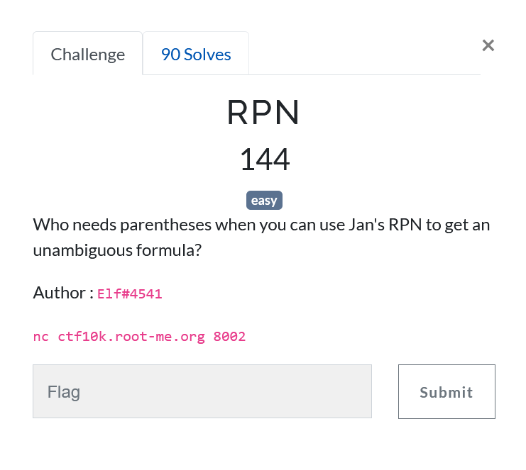
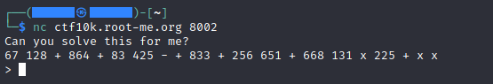
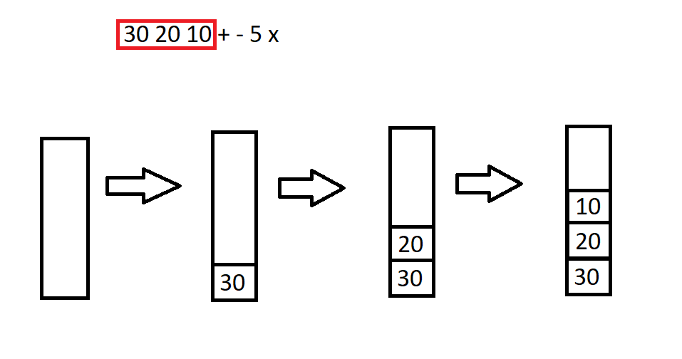
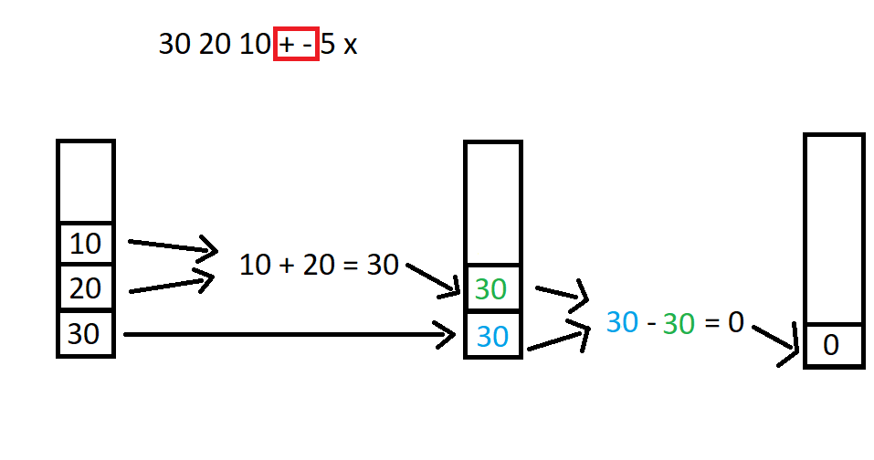
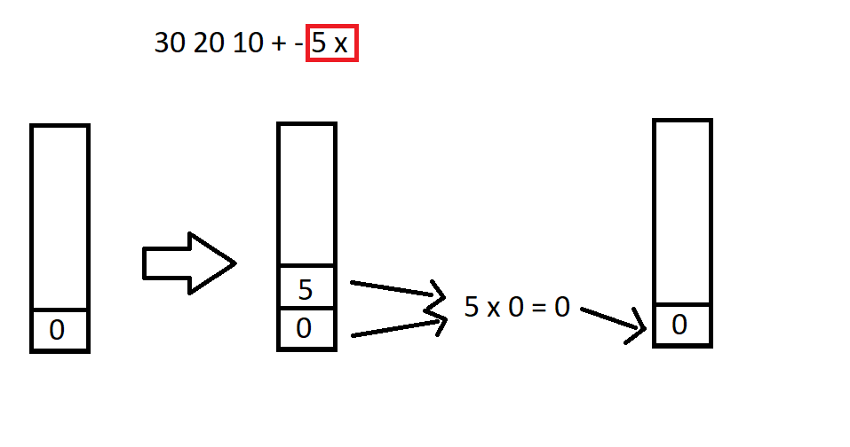

# RPN




## Goal

Let's see what the challenge consist of, to do that, were gonna use netcat



We can see that the server asks for the result of an equation asked in a strange way.

Let's see what RPN is.

## Explanation of RPN

According to [wikipedia](https://en.wikipedia.org/wiki/Reverse_Polish_notation), RPN or Reverse Polish Notation is a way of writting equations with stacks. Let's see an example :

Let's do the example with `30 20 10 + - 5 x`

First step, create an empty stack and fill it wit the number left to right, until we reach an operation.



Then for each operation, we need to do `number2 operation number1`, number1 is the first number, on top of the stack and number2 the second. And then we replace the 2 numbers by the result.



Finally, we do this for all the equation, each time we encounter a number, we store it on top of the stack and each time it's an opertaion, we replace the 2 numbers on top by the result.



And if the equation was correct and we've done our work correctly, it should normally remain only one number, wich is the result. Here, for the example, the result is 0.


## Main program

```python


import socket

host = "ctf10k.root-me.org"
port = 8002
s = socket.socket(socket.AF_INET, socket.SOCK_STREAM)
s.connect((host, port))

eq = s.recv(1024).decode() # first patern is different so we do it outside of the loop
print(eq)
eq = eq.replace("Can you solve this for me?", '').replace('\n', '').replace(">", '')

while True:
    nb = []
    for poss in eq.split(' '): # for each number/operation in the equation

        if poss == '':
            pass
        elif poss in ['+', '-', 'x']: # if it's an operation
            if poss == '+':
                nb[-2] += nb[-1]
            elif poss == '-':
                nb[-2] -= nb[-1]
            else:
                nb[-2] = nb[-2] * nb[-1]
            nb.pop() # don't forget to remove the last number after the calculus
        else: # if it's a number
            nb.append(int(poss))


    total = nb[0] # only one number remaining


    print("Result :", total)

    total = str(total) + '\n'
    s.send(total.encode()) # send the answer

    eq = s.recv(1024).decode() # the patern changed from the first question
    print(eq)
    eq = eq.replace("That's correct!\nAnd this?\n", '')
    eq = eq.replace("\n> ", "").replace("\n", '')
```


It only remains to execute our code and watch the results.


```

Can you solve this for me?
289 565 + 256 593 - 738 + + 222 638 x + 685 +
> 
Result : 143576
That's correct!
And this?
744 814 x 783 x 433 365 + 858 897 696 941 135 x 305 810 + 348 995 373 x x - - - - x x + 663 x 267 55 x x
> 
Result : 861816941359966165860
That's correct!
And this?
431 871 x 733 + 187 641 590 - 757 x 721 + 792 x 207 140 381 759 + 438 x + + x - +
> 
Result : -15563515414271
That's correct!
And this?
825 968 918 + - 496 x 335 x 619 + 40 816 613 - - 547 430 x - +
> 
Result : -176530514
That's correct!
And this?
848 705 186 + 470 x x 97 +
> 
Result : 355117057
That's correct!
And this?
829 569 555 986 + - 89 134 - x + 215 x 470 843 x - 867 - 900 + 982 451 x + 324 -
> 
Result : 9628716
That's correct!
And this?
852 394 - 804 793 - 580 413 x 375 - x 27 45 35 x x - -
> 
Result : -2587832

[ .................. ]

That's correct!
And this?
975 767 269 669 826 - 636 x - 768 13 + x 167 - + x 443 563 880 + + +
> 
Result : 76240225361
That's correct!
And this?
787 517 x 546 + 144 x 5 -
> 
Result : 58669195
That's correct!
And this?
460 979 x
> 
Result : 450340
That's correct!
And this?
642 542 62 + + 577 + 806 361 23 + - x 727 69 734 722 228 440 x + - + - -
> 
Result : 668340
That's correct!
And this?
114 602 - 591 561 883 483 - 332 + x 208 x + 30 611 - + -
> 
Result : -85416114
That's correct!
Congratz! Your flag is RM{Luk4s13w1cz_w0uld_b3_pr0ud}
```

Here we got the flag `RM{Luk4s13w1cz_w0uld_b3_pr0ud}`.

Thanks Elf for the challenge and thank you for reading ! 

