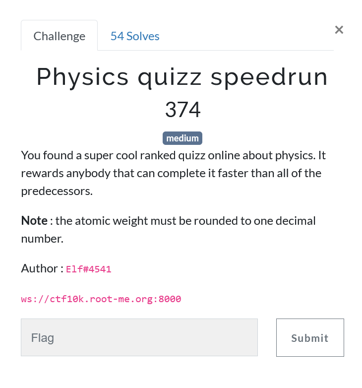

# Physics quizz speedrun



## Context

We are given a websocket port `ws://ctf10k.root-me.org:8000` where a bot asks questions about atoms.

If we try connecting to the port with the python websocket library with the code bellow

```python
import asyncio
import websockets

async def main():
    async with websockets.connect('ws://ctf10k.root-me.org:8000') as websocket:
        response = await websocket.recv()
        print(response)

asyncio.get_event_loop().run_until_complete(main())
```

We can see the response 

```
010000110110000101101110001000000111100101101111011101010010000001110100011001010110110001101100001000000110110101100101001000000111011101101000011000010111010000100000011010010111001100100000011101000110100001100101001000000110000101110100011011110110110101101001011000110010000001110111011001010110100101100111011010000111010000100000011011110110011000100000010001000111010101100010011011100110100101110101011011010010000001110000011011000110010101100001011100110110010100111111
```

After decoding it with this simple script

```python
byte = ""
final_string = ""
for bit in response:
    byte += bit
    if len(byte) >= 8:
        final_string += chr(int(byte, 2))
        byte = ""
print(final_string)
```

It appears that the message was a question 
```
Yo, please tell me what is the value of the number of electrons for the Plutonium
```

After launching this program a few time we can tell that the server as 2 way of asking, first one in informal way (message above) and second in formal way.

```
Can you tell me what is the atomic weight of Nihonium please?
```

The script also asks for 3 different informations :

- The atomic weight

- The number of electrons

- The cas number


## Finding the data

Firstly lets search for the atomic weight and the number of electrons 

I took a [table full of data](https://encycloreader.org/r/handwiki.php?q=Physics:List_of_elements_by_atomic_properties) and copied it into a file, after doing the challenge I noticed that it wasn't the best choice to andle the data because they were to many but nervermind.

Secondly, it remained to find the cas that aren't listed in this website. This time I used my brain to take a [website](https://periodictable.com/Properties/A/CASNumber.html) that only listed the cas.

Now that I had all the data needed, I could start programming.

## Programmation

So to sum up, we had two file, [one for the number of nucleon and the atomic wieght](./prog_physic_db.txt). And [another for the cas numbers](./cas_number_db.txt).

- first file : 
```
1 	Hydrogen 	H 	1.007 	2.2 	13.59844 	25 	120 	38 	1
2 	Helium 	He 	4.002602(2) 	— 	24.58741 	31 	140 	32 	2
...
```
With the first column representing the number of electron and the fouth one the atomic weight.

- Second file :
```
Hydrogen	CAS1333-74-0
Niobium	CAS7440-03-1
Thallium	CAS7440-28-0
....
```

So we firstly needed to do a function that was going to get the atom's name and the data to send. And after that, fetch the right data in the database.

```python

# open files as global variable to avoid re-opening them for each request
with open('prog_physic_db.txt', 'r') as f:
    reference = f.readlines()

with open("cas_number_db.txt", 'r') as f:
    reference_cas = f.readlines()

def andler(text):

    # replace the question part
    text = text.replace("Yo, please tell me what is the value of the ", '')
    text = text.replace("Can you tell me what is the ", '')
    text = text.replace(" please?", '')

    # case we need the atomic weight
    if "atomic weight" in text:

        # there is 2 way of asking, so we need to remove both possible sentences
        text = text.replace("atomic weight of ", '')
        text = text.replace("atomic weight for the ", '')
        text = text.replace(' ', '')

        print("Detected atom :", text)


        for line in reference:
            if text in line:
                # the atomic weights that are integers are between []
                if "[" in line:
                    answer = line[line.index("["):line.index("]")]
                # the ones that aren't integers have a '(' just after the value and always have a '.' 
                # there are also < 999 so we just need the 3 numbers before the '.'
                else:
                    # -3 because atomic weight < 999
                    answer = line[line.index(".")-3:line.index("(")]
                # in case it's less than 100 it could have selected a '\t' or ' '
                answer = answer.replace('\t', '')
                answer = answer.replace(' ', '')
                answer = answer.replace('[', "").replace("[", '')


                if "." in answer:
                    # return the value rounded to 0.1 (needed because of the differnces between databases)
                    return str(round(float(answer),1))
                else:
                    return answer


    elif "cas number" in text:
        # there is also 2 ways of asking so we need to remove both
        text = text.replace("cas number of ", '')
        text = text.replace("cas number for the ", '')
        text = text.replace(' ', '')

        print("Detected atom :", text)

        for line in reference_cas:
            if text in line:
                # because of the copy/paste we need to take care of the lines where the name
                # and the cas are separated with a ' ' and with a '\t'
                if '\t' in line:
                    answer = line.split('\t')[1]
                else:
                    answer = line.split(' ')[1]
                answer = answer.replace('\t', '').lower()
                answer = answer.replace(' ', '')

                return answer.replace('\n', '').upper().replace("CAS", '')

    elif "number of electrons" in text:
        # same as for the 2 others
        text = text.replace("number of electrons of", '')
        text = text.replace("number of electrons for the", '')
        text = text.replace(' ', '')

        print("Detected atom :", text)

        for line in reference:
            if text in line:
                # the number of electron is the first column and the name is the second
                # so we can just select what's before the name to get the number of electron
                answer = line.lower().split(text.lower())[0]
                answer = answer.replace(" ", '')

                return str(int(answer))


```


Now it only remains to do an infinit loop to answer all the questions.

```python
import asyncio
import websockets

async def main():
    async with websockets.connect('ws://ctf10k.root-me.org:8000') as websocket:
        while True:
            
            # listen to the message
            response = await websocket.recv()

            # decode the message
            byte = ""
            final_string = ""
            for bit in response:
                byte += bit
                if len(byte) >= 8:
                    final_string += chr(int(byte, 2))
                    byte = ""

            print("Question : ")
            print(final_string)

            # call our function to get the answer
            answ = andler(final_string)

            print("Sending :", answ)

            # encode into 0 and 1
            binary_resp = ""
            for l in answ:
                binary_resp += "0"*(10-len(bin(ord(l)))) + bin(ord(l)).replace('0b', '')

            # send response
            await websocket.send(binary_resp)
            
            # we don't care about the line saying "congratulations ...."
            await websocket.recv()


asyncio.get_event_loop().run_until_complete(main())

```

It only remained to execute our function and admire the result.


```
Question : 
Can you tell me what is the atomic weight of Barium please?
Detected atom : Barium
Sending : 137.3
Question : 
Yo, please tell me what is the value of the number of electrons for the Californium
Detected atom : Californium
Sending : 98
Question : 
Yo, please tell me what is the value of the cas number for the Hydrogen
Detected atom : Hydrogen
Sending : 1333-74-0
Question : 
Yo, please tell me what is the value of the cas number for the Osmium
Detected atom : Osmium
Sending : 7440-04-2
Question : 
Yo, please tell me what is the value of the cas number for the Mendelevium
Detected atom : Mendelevium
Sending : 7440-11-1
Question : 
Yo, please tell me what is the value of the cas number for the Roentgenium
Detected atom : Roentgenium
Sending : 54386-24-2
Question : 
Can you tell me what is the number of electrons of Nobelium please?
Detected atom : Nobelium
Sending : 102
Question : 
Yo, please tell me what is the value of the cas number for the Cerium
Detected atom : Cerium
Sending : 7440-45-1
Question : 
Can you tell me what is the atomic weight of Arsenic please?
Detected atom : Arsenic
Sending : 74.9
Question : 
Can you tell me what is the atomic weight of Gold please?
Detected atom : Gold
Sending : 197.0
Question : 
Yo, please tell me what is the value of the atomic weight for the Gadolinium
Detected atom : Gadolinium
Sending : 157.2
Question : 
Can you tell me what is the number of electrons of Chromium please?
Detected atom : Chromium
Sending : 24
Question : 
Can you tell me what is the atomic weight of Iridium please?
Detected atom : Iridium
Sending : 192.2
Question : 
Can you tell me what is the cas number of Meitnerium please?
Detected atom : Meitnerium
Sending : 54038-01-6
Question : 
Can you tell me what is the number of electrons of Boron please?
Detected atom : Boron
Sending : 5
Question : 
Yo, please tell me what is the value of the number of electrons for the Meitnerium
Detected atom : Meitnerium
Sending : 109
Question : 
Can you tell me what is the number of electrons of Tennessine please?
Detected atom : Tennessine
Sending : 117
Question : 
Yo, please tell me what is the value of the cas number for the Tantalum
Detected atom : Tantalum
Sending : 7440-25-7
Question : 
Can you tell me what is the cas number of Erbium please?
Detected atom : Erbium
Sending : 7440-52-0
Question : 
Yo, please tell me what is the value of the atomic weight for the Sulfur
Detected atom : Sulfur
Sending : 32.1
Question : 
Can you tell me what is the cas number of Dubnium please?
Detected atom : Dubnium
Sending : 53850-35-4
Question : 
Can you tell me what is the atomic weight of Lutetium please?
Detected atom : Lutetium
Sending : 175.0
Question : 
Yo, please tell me what is the value of the number of electrons for the Iodine
Detected atom : Iodine
Sending : 53
Question : 
Yo, please tell me what is the value of the atomic weight for the Argon
Detected atom : Argon
Sending : 39.9
Question : 
Can you tell me what is the cas number of Phosphorus please?
Detected atom : Phosphorus
Sending : 7723-14-0
Question : 
Can you tell me what is the atomic weight of Uranium please?
Detected atom : Uranium
Sending : 238.0
Question : 
Yo, please tell me what is the value of the number of electrons for the Cadmium
Detected atom : Cadmium
Sending : 48
Question : 
Yo, please tell me what is the value of the number of electrons for the Xenon
Detected atom : Xenon
Sending : 54
Question : 
Can you tell me what is the number of electrons of Uranium please?
Detected atom : Uranium
Sending : 92
Question : 
Yo, please tell me what is the value of the atomic weight for the Calcium
Detected atom : Calcium
Sending : 40.1
Question : 
Yo, please tell me what is the value of the number of electrons for the Radium
Detected atom : Radium
Sending : 88
Question : 
Can you tell me what is the number of electrons of Lead please?
Detected atom : Lead
Sending : 82
Question : 
Can you tell me what is the cas number of Thulium please?
Detected atom : Thulium
Sending : 7440-30-4
Question : 
Yo, please tell me what is the value of the atomic weight for the Nihonium
Detected atom : Nihonium
Sending : 286
Question : 
Can you tell me what is the number of electrons of Molybdenum please?
Detected atom : Molybdenum
Sending : 42
Question : 
Can you tell me what is the atomic weight of Tungsten please?
Detected atom : Tungsten
Sending : 183.8
Question : 
Yo, please tell me what is the value of the atomic weight for the Tellurium
Detected atom : Tellurium
Sending : 127.6
Question : 
Can you tell me what is the number of electrons of Mendelevium please?
Detected atom : Mendelevium
Sending : 101
Question : 
Yo, please tell me what is the value of the cas number for the Fermium
Detected atom : Fermium
Sending : 7440-72-4
Question : 
Yo, please tell me what is the value of the cas number for the Terbium
Detected atom : Terbium
Sending : 7440-27-9
Question : 
Can you tell me what is the atomic weight of Neodymium please?
Detected atom : Neodymium
Sending : 144.2
Question : 
Can you tell me what is the cas number of Radium please?
Detected atom : Radium
Sending : 7440-14-4
Question : 
Can you tell me what is the number of electrons of Rhodium please?
Detected atom : Rhodium
Sending : 45
Question : 
Can you tell me what is the cas number of Scandium please?
Detected atom : Scandium
Sending : 7440-20-2
Question : 
Can you tell me what is the atomic weight of Roentgenium please?
Detected atom : Roentgenium
Sending : 282
Question : 
Yo, please tell me what is the value of the atomic weight for the Dysprosium
Detected atom : Dysprosium
Sending : 162.5
Question : 
Yo, please tell me what is the value of the atomic weight for the Thulium
Detected atom : Thulium
Sending : 168.9
Question : 
Can you tell me what is the atomic weight of Krypton please?
Detected atom : Krypton
Sending : 83.8
Question : 
Can you tell me what is the cas number of Carbon please?
Detected atom : Carbon
Sending : 7440-44-0
Question : 
Can you tell me what is the cas number of Lithium please?
Detected atom : Lithium
Sending : 7439-93-2
Question : 
Congratz, you got the speedrun world record! Here's your price: RM{4t0ms_sp33drunn3r_sp3c14l1st}
```

And here we got the flag `RM{4t0ms_sp33drunn3r_sp3c14l1st}`.


## Bonus : other way of doing it ?!?

Exploit found by Oblivios

What if there was a way to get the flag in less than 20 lines of code ?

Okay, let's try to send wathever to the challenge.

```python

import asyncio
import websockets

async def test():
    async with websockets.connect('ws://ctf10k.root-me.org:8000') as websocket:
        print(dc(await websocket.recv()))
        await websocket.send("whatever")
            
asyncio.get_event_loop().run_until_complete(test())

```
If we do this, server will answer with 

```
0101001101101111011100100111001001111001001011000010000001001001001000000110010001101111011011100010011101110100001000000111001101110000011001010110000101101011001000000111100101101111011101010111001000100000011011000110000101101110011001110111010101100001011001110110010100101100001000000100100100100111011011010010000001100001001000000110001101101111011011010111000001110101011101000110010101110010001011100010111000101110
```
Which once decoded says : `Yo, please tell me what is the value of the cas number for the Flerovium
Sorry, I don't speak your language, I'm a computer...`.

Okay, that seems normal but what if we try to put this instruction in an infinite loop. It'll obvioulsy just spam the server whit `whatever`.

```python
import asyncio
import websockets

def dc(response):
    byte, final_string = "", ""
    for bit in response:
        byte += bit
        if len(byte) >= 8:
            final_string += chr(int(byte, 2))
            byte = ""
    return final_string

async def test():
    async with websockets.connect('ws://ctf10k.root-me.org:8000') as websocket:
        while True:
            print(dc(await websocket.recv()))
            await websocket.send("whatever")
            
asyncio.get_event_loop().run_until_complete(test())
```

It gives the output : 

```
Yo, please tell me what is the value of the cas number for the Flerovium
Sorry, I don't speak your language, I'm a computer...
Yo, please tell me what is the value of the cas number for the Flerovium
Sorry, I don't speak your language, I'm a computer...

[....same thing....]

Yo, please tell me what is the value of the cas number for the Flerovium
Sorry, I don't speak your language, I'm a computer...
Yo, please tell me what is the value of the cas number for the Flerovium
Sorry, I don't speak your language, I'm a computer...
Congratz, you got the speedrun world record! Here's your price: RM{4t0ms_sp33drunn3r_sp3c14l1st}
```

So, this also works, a misconfiguration, maybe in the identation of the program allows someone to get the flag just by sending a lot of requests that aren't encoded. This misconfiguration was reported and patched during the ctf.

In any case we got the flag, you can find the source code for the "normal" version [here](./websocket_chall.py).

Thanks for reading !
